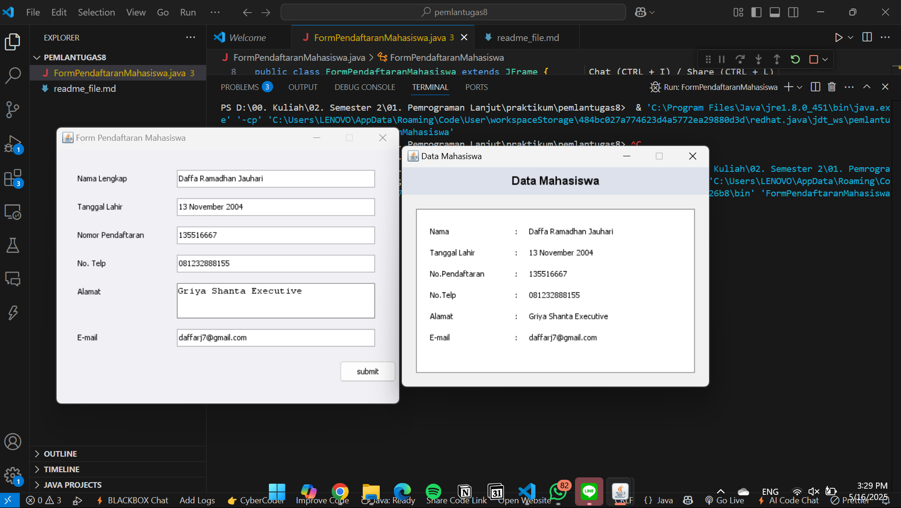

# pemlantugas8
# Form Pendaftaran Mahasiswa Java Swing

Aplikasi form pendaftaran mahasiswa sederhana yang dibuat menggunakan Java Swing. Aplikasi ini memungkinkan pengguna untuk mengisi data mahasiswa dan menampilkan hasilnya dalam jendela baru setelah validasi dan konfirmasi.



## Fitur

- Form input data mahasiswa
- Validasi form (semua field harus diisi)
- Dialog konfirmasi sebelum pengiriman data
- Tampilan data yang telah diinput pada jendela baru

## Struktur Aplikasi

### 1. Komponen Utama

```java
// Komponen form
private JTextField txtNama, txtTanggalLahir, txtNoPendaftaran, txtNoTelp, txtEmail;
private JTextArea txtAlamat;
private JButton btnSubmit;
```

Aplikasi menggunakan komponen Java Swing dasar untuk membuat antarmuka pengguna:
- `JTextField` untuk input teks satu baris
- `JTextArea` untuk input teks beberapa baris (alamat)
- `JButton` untuk tombol submit

### 2. Inisialisasi Form

```java
private void initComponents() {
    // Panel utama
    JPanel mainPanel = new JPanel();
    mainPanel.setLayout(null);
    mainPanel.setBackground(new Color(240, 240, 245));
    
    // Label dan TextField untuk Nama Lengkap
    JLabel lblNama = new JLabel("Nama Lengkap");
    lblNama.setBounds(30, 30, 150, 25);
    txtNama = new JTextField();
    txtNama.setBounds(170, 30, 280, 25);
    
    // ... komponen lainnya ...
    
    // Tambahkan komponen ke panel
    mainPanel.add(lblNama);
    mainPanel.add(txtNama);
    // ... tambahkan komponen lain ...
    
    // Tambahkan panel ke frame
    add(mainPanel);
}
```

Metode `initComponents()` bertanggung jawab untuk:
- Membuat panel utama dengan layout absolut (`null` layout)
- Menginisialisasi semua komponen UI (label, field, dan tombol)
- Menentukan posisi dan ukuran setiap komponen menggunakan metode `setBounds()`
- Menambahkan semua komponen ke panel utama

### 3. Validasi Form

```java
private boolean validateForm() {
    if(txtNama.getText().trim().isEmpty() || 
       txtTanggalLahir.getText().trim().isEmpty() ||
       txtNoPendaftaran.getText().trim().isEmpty() ||
       txtNoTelp.getText().trim().isEmpty() ||
       txtAlamat.getText().trim().isEmpty() ||
       txtEmail.getText().trim().isEmpty()) {
        
        JOptionPane.showMessageDialog(
            this,
            "Semua kolom harus diisi!",
            "Validasi Form",
            JOptionPane.WARNING_MESSAGE
        );
        return false;
    }
    return true;
}
```

Metode `validateForm()` melakukan:
- Memeriksa semua field untuk memastikan tidak ada yang kosong
- Menampilkan pesan peringatan jika ada field yang kosong
- Mengembalikan nilai boolean yang menunjukkan apakah form valid

### 4. Penanganan Event

```java
btnSubmit.addActionListener(new ActionListener() {
    @Override
    public void actionPerformed(ActionEvent e) {
        if(validateForm()) {
            int confirm = JOptionPane.showConfirmDialog(
                FormPendaftaranMahasiswa.this,
                "Apakah anda yakin data yang Anda isi sudah benar?",
                "Konfirmasi Data",
                JOptionPane.YES_NO_OPTION
            );
            
            if(confirm == JOptionPane.YES_OPTION) {
                showDataResult();
            }
        }
    }
});
```

ActionListener pada tombol submit:
- Memvalidasi form terlebih dahulu
- Menampilkan dialog konfirmasi
- Jika pengguna mengkonfirmasi data, menampilkan jendela hasil data

### 5. Menampilkan Hasil Data

```java
private void showDataResult() {
    // Buat jendela baru
    JFrame resultFrame = new JFrame("Data Mahasiswa");
    // ... inisialisasi jendela ...
    
    // Tampilkan data dalam panel
    JLabel lblDataNama = new JLabel("Nama");
    // ... inisialisasi label data ...
    
    JLabel lblValueNama = new JLabel(txtNama.getText());
    // ... inisialisasi label nilai ...
    
    // ... tambahkan komponen ke panel ...
    
    // Tampilkan jendela
    resultFrame.setVisible(true);
}
```

Metode `showDataResult()`:
- Membuat jendela baru untuk menampilkan data
- Mengatur layout dan komponen UI untuk menampilkan data yang dimasukkan
- Menampilkan data dalam format label dan nilai
